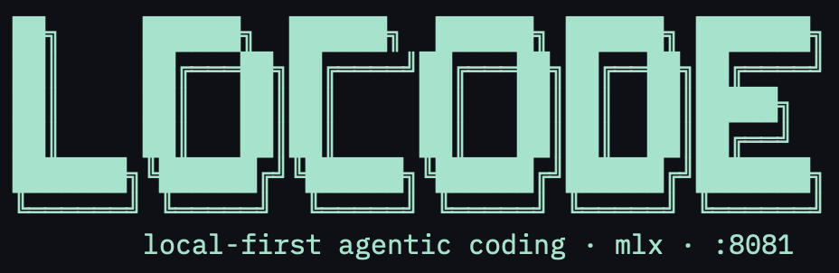

<p align="center">
  
</p>

# locode

A Claude Code–style **agentic CLI for local LLMs** served by an
OpenAI-compatible endpoint (e.g. [`mlx-lm`](https://github.com/ml-explore/mlx-lm)
on Apple Silicon). It reads, writes, and edits files, runs shell commands, and
can ask you multiple-choice questions — all driven by an on-device model, with a
**tolerant tool-use harness** built for local models that function-call
unreliably (mis-escaped JSON, fenced vs. native tool calls, flat vs. nested
argument schemas).

## Why

Local models are cheap and private, but they call tools inconsistently. locode
wraps a local model server with a parser and agent loop that recover usable tool
calls from messy output, plus a permission layer so an autonomous model can't
touch sensitive paths.

## Features

- **Tolerant tool parsing** — handles native `tool_calls`, fenced ` ```tool `
  blocks, and best-effort salvage of malformed or mis-escaped JSON.
- **Filesystem, shell, and web tools** — `read_file`, `ls`, `glob`, `grep`,
  `write_file`, `edit_file`, `move_file`, `bash`, plus optional web search/fetch.
- **Permission layer** — read-only tools run automatically; mutating tools
  prompt; configurable `deny_paths` are hard-blocked even under `--yolo`.
- **Server lifecycle management** — starts/stops a local model server with
  per-model memory budgeting for single-GPU setups, or talks to one on
  [another machine](#using-a-model-server-on-another-machine) and leaves it alone.
- **Interactive REPL and headless one-shot** modes.
- **`locode bench`** — four real coding tasks, easy to hard, run against
  your models on your machine so you can pick one on evidence rather than
  on a model card. See [Benchmarking](#benchmarking-your-models).

## Requirements

- Python ≥ 3.10
- An OpenAI-compatible model server. On Apple Silicon, that's
  [`mlx-lm`](https://github.com/ml-explore/mlx-lm):

  ```bash
  pip install mlx-lm
  mlx_lm.server --model <hf-model-id> --port 8081
  ```

  It does not have to be on this machine — see
  [Using a model server on another machine](#using-a-model-server-on-another-machine).

## Install

```bash
curl -fsSL https://raw.githubusercontent.com/vszal/locode/main/install.sh | bash
```

`install.sh` clones the repo to `~/.local/share/locode/src` and installs locode
from it (via `pipx`, else `uv`, else `pip install --user`), recording how so
updates are one command.

> **Note:** PyPI publishing is deferred (the `locode` name on PyPI is an
> unrelated package), so for now the installer pulls from this git repo rather
> than from PyPI. `locode upgrade` does a `git pull` + reinstall.

```bash
locode upgrade            # update in place (git pull + reinstall)
locode upgrade --check    # show the install method + what it would run
locode uninstall          # remove it (add --purge to drop config/state too)
```

Run `./install.sh --help` for `--dev` (editable install from a checkout) and
`--dry-run`.

First run writes a short starter config to `~/.config/locode/config.toml`
(edit the model aliases to match what you've pulled). See
[`config.toml.example`](config.toml.example) for every available option and
its default.

### Example configuration

A complete, working `~/.config/locode/config.toml`. Aliases are yours to
choose; anything containing `/` is treated as a full Hugging Face id, so
aliases are a convenience, not a requirement.

```toml
[model]
default = "qwen38"          # loaded at startup; override per-run with -m

[aliases]
qwen38      = "lukaskremla/Qwen3.8-27B-3bit-MLX-TextOnly"   # ~11 GB
qwythos9    = "sahilchachra/Qwythos-9B-Claude-Mythos-5-1M-mxfp8-mlx"  # ~9.6 GB
qwencoder14 = "mlx-community/Qwen2.5-Coder-14B-Instruct-4bit"
qwen4i      = "mlx-community/Qwen3-4B-Instruct-2507-4bit"   # fast, trivial edits

[thinking]
# Some models emit chain-of-thought locode can't stream, which looks like a
# hang. "off" suppresses it; "auto" defers to the model's own template.
qwythos9 = "off"

[agent]
max_iterations = 150        # a multi-file task can need dozens

[permissions]
deny_paths = ["~/.ssh", "~/.aws", "~/.config/gh"]   # hard-denied even under --yolo

[server]
port = 8081
memory_reserve_gb = 5.0     # refuse a model that would not leave this much free
```

**Picking a default.** Judge a local model by *time-to-done*, not tokens/sec —
the two disagree sharply. On the `repro-only` case (n=20 per model) `qwen38`
generates at about 22 chars/s against `qwythos9`'s 76 — nearly four times slower
per character — and still finishes sooner, 95s against 116s, because it gets
there in 5.5 steps where `qwythos9` needs 8.7. On a memory-tight machine (16 GB)
prefer `qwythos9`: at ~11 GB, `qwen38` will not fit under the memory budget.
See [`MODELS.md`](MODELS.md) — and don't take our word for any of it, measure
your own machine with [`locode bench`](#benchmarking-your-models).

## Using a model server on another machine

"Local" means *your* hardware, not necessarily *this* box. If you keep a
dedicated GPU machine on the LAN, point locode at it:

```bash
locode --base-url http://gpu-box.lan:8081        # full URL
locode --host 192.168.1.42 --port 8081           # host/port
LOCODE_BASE_URL=http://gpu-box.lan:8081 locode   # environment
```

or make it the default in `~/.config/locode/config.toml`:

```toml
[server]
host = "192.168.1.42"
port = 8081
scheme = "http"          # "https" if you front it with TLS
# base_url = "https://gpu-box.lan"   # full override; wins over scheme/host/port
manage = "auto"          # own the server process? "auto" = yes iff loopback
```

**What changes when the endpoint is remote.** locode decides whether it *owns*
the server process from the endpoint: loopback means it may start, stop and
switch models; anything else it treats as someone else's server and leaves
alone. Set `manage` explicitly to override the guess. On a remote endpoint:

- **It will not start a server for you.** If nothing answers, you get
  `no model server reachable at <url>` rather than a local process appearing
  on the wrong machine.
- **It will not switch models.** A remote box serves whatever it was launched
  with. `-m` still selects *among* the models the endpoint reports serving; ask
  for one it does not serve and locode says so instead of silently using the
  wrong model. Two consequences worth knowing: `/server restart` and friends
  are unavailable, and `locode bench -m a -m b` can only compare two models if
  the endpoint actually serves both.
- **The memory guard does not apply.** The RAM budget that refuses an
  oversized model protects *this* machine; on a remote endpoint the remote box
  is responsible for what it loads.

Benchmarking takes the same flags, which is usually the point — the dedicated
box is the one worth measuring:

```bash
locode bench --base-url http://gpu-box.lan:8081 -m qwen38
```

**A word on the wire.** Prompts carry your source code, and `http://` on a LAN
is plaintext to anything on that network. `mlx_lm.server` has no
authentication, so a server bound to `0.0.0.0` is readable and usable by every
host that can route to it. Bind it to the interface you mean, keep it behind
your firewall, and use `scheme = "https"` with a TLS-terminating proxy if the
traffic leaves a network you control.

## Benchmarking your models

**Why bother.** Nothing on a model card tells you which local model will
finish your work. Parameter count, quantisation and tokens/sec all describe how
a model *types*, not whether it arrives at a working fix, and they disagree
with each other often enough that choosing on paper is close to guessing. The
numbers in this README came off one M4 Pro; yours will differ with your
hardware, your quant and your config. `locode bench` gets you your own.

It is also the same measurement this project runs on itself — these four cases
and their graders are what the default-model choices above rest on, not a
separate marketing benchmark.

```bash
locode bench                          # your configured default model
locode bench -m qwen38 -m qwythos9    # compare two
```

**What a run actually does.** For each model-and-case pair, `locode bench`:

1. copies the case's seed workspace into a fresh temporary directory;
2. runs one real headless `locode` turn in it — your server, your config, the
   real tool set, editing real files on disk;
3. times it end to end in wall-clock seconds;
4. grades the workspace the model left behind with the case's `check.py`,
   which inspects the resulting files and the run's event log;
5. deletes the workspace (`--keep` keeps it, with the event log inside).

Nothing is mocked and nothing is fetched: the seeds ship inside the wheel and
the cases run offline. Your model server does have to be up (see
[Requirements](#requirements)) — if it is not, the run reports `ERROR` rather
than a bad score.

**The ladder** runs easy to hard, so a model that cannot clear the floor shows
it in the first two minutes instead of after the twenty-minute case:

| case | | what it asks for |
|---|---|---|
| `exec-pinpoint` | warm-up | three one-line bugs that a failing traceback points straight at |
| `exec-bugfix` | easy | three logic bugs in a string library; fix until `pytest` is green |
| `repro-only` | medium | *"the top charges list is wrong. fix it"* — no test suite, and the defect (amounts sorted as strings) is near-invisible by reading. The model has to actually run the thing |
| `multi-defect-blind` | hard | five defects in a module with no tests at all; the model has to build its own reproduction from the docstrings |

**Reading the report.** Every cell is an outcome plus a wall-clock time. At
`--repeat N` the outcome becomes a hit rate (`2/3`) and the time an average.

- **`solved`** counts runs that scored a *perfect* 1.000. Each ladder case is
  one a capable model takes all the way, so partial credit means something was
  left broken, and the cell reads `FAIL`. A partial score is the fraction of
  the required behaviours the model actually got right; a run that cheats —
  edits the tests, rewrites the fixture data, breaks something that already
  worked — scores 0.000 outright, however much else it fixed.
- **`time-to-done`** is what you wait through for one pass of the ladder, and
  the headline for that reason alone. Read it *after* `solved`, never instead
  of it: giving up early is the fastest thing a model can do.
- **`iterations`** is the *explanation*, not the verdict: a model generally
  wins by needing fewer steps, not by typing faster.
- **`ERROR`** means the run never reached its first turn — server down, alias
  unresolved. It suppresses the recommendation and exits non-zero, because a
  model that never loaded has not been measured.

The recommendation goes on `solved` first and uses time only to break a tie.
Here is a real run — `locode bench -m qwen38 -m qwythos9 --repeat 3`, M4 Pro,
24 GB, three passes per cell:

```
case                qwen38            qwythos9
------------------  ----------------  ----------------
exec-pinpoint       ok      135s      ok       43s
exec-bugfix         ok      126s      ok       66s
repro-only          ok       93s      1/3     166s
multi-defect-blind  ok      175s      2/3     131s
------------------  ----------------  ----------------
solved              12/12             9/12
time-to-done/pass   529s              405s
iterations/pass     27                48

qwen38 recommended — solves more (12 vs 9).
```

**That table is the whole argument for the metric.** `qwythos9` is 23% faster
per pass — 405s against 529s — and solves fewer runs, 9/12 against a clean
12/12. Ranking on time would pick it and be wrong.

We ran that identical command twice, same build, same machine. The first sweep
put `qwythos9` at **5/12**, the second at **9/12** — a swing wide enough that
the first is significant against `qwen38` (p=0.005) and the second, on its own,
is not (p=0.22). The two are statistically consistent with each other
(p=0.21), so pooling is fair: **24/24 against 14/24, p=0.0006.** Two things
follow, and both are the point of this section:

- **Three passes is not many.** `--repeat 3` buys you a hit rate instead of a
  coin flip, which is a real upgrade over one pass, but it does not buy you a
  verdict on a model that varies this much. If a comparison matters, run it
  twice and pool.
- **The ranking failure replicated even though the margin did not.** In *both*
  sweeps `qwythos9` finished a pass faster and solved less. That is the claim
  time-to-done exists to survive, and it survived.

The `1/3` and `2/3` cells are what repeats buy: the same model, the same task,
solved once and missed twice. A single pass would have called those `ok` or
`FAIL` with equal confidence and been a coin flip either way. Note how steady
`qwen38` is by comparison — 123/123/159s on `exec-pinpoint`, 24/24 solved
across both sweeps; consistency is itself a property worth seeing before you
pick a daily driver.

**Flags.**

| flag | |
|---|---|
| `-m ALIAS` | model to measure; repeat it to compare. Defaults to your configured default model |
| `-c ID` | run one case instead of the whole ladder; repeatable |
| `--repeat N` | N passes per cell (default 1) — local models vary run to run, and 3 gives a much firmer answer |
| `--keep` | leave each scratch workspace and its event log on disk to read afterwards |
| `--list` | print the ladder and exit without running anything |
| `--base-url` / `--host` / `--port` | measure a server on another machine; see [above](#using-a-model-server-on-another-machine) |

The full ladder drives a real model through real work, so budget minutes per
model, not seconds. Exit status is `0` when the measurement ran (*including*
when a model scores badly — that is a valid result) and `2` when something
stopped it from measuring at all, which makes it safe to gate on in CI.

## Development setup (from source)

```bash
git clone https://github.com/vszal/locode.git
cd locode
python -m venv .venv && .venv/bin/pip install -e ".[dev]"
# or, equivalently:  ./install.sh --dev

# In another shell, start a local model server (see Requirements), then:
.venv/bin/locode                          # interactive REPL
.venv/bin/locode -p "summarize cli.py"    # headless, one turn
```

## Usage

- **Interactive:** `locode` — streaming output, `Esc`/`Ctrl-C` to interrupt a
  running turn, and slash commands (`/model`, `/server`, `/open`, `/clear`,
  `/help`, …).
- **Headless:** `locode -p "<task>"` (or pipe via stdin). ASK-gated tools
  (`write_file`, `edit_file`, `bash`) are denied unless pre-allowed with
  `--allow-tool write_file,bash`; read-only tools always run.
- **Model selection:** `locode -m <alias-or-hf-id>`. Define short aliases in
  your config; any value containing `/` is treated as a full Hugging Face id.
- **`--yolo`** flips ASK→AUTO (configured `deny_paths` are still enforced).
- **Reasoning toggle:** some local models emit chain-of-thought that locode
  can't stream (it looks like a hang). Override per model in `config.toml`:
  ```toml
  [thinking]
  # alias or model-id substring -> "on" | "off" | "auto"
  qwythos9 = "off"    # suppress reasoning (enable_thinking=false)
  devstral24 = "on"  # force it on for hard diagnosis
  ```
  Unlisted models use locode's per-model default; `"auto"` omits the kwarg and
  lets the model's own template decide.

- **Turn budget:** a turn runs until the model stops calling tools or a budget
  trips. For non-native (fenced ` ```tool `) callers the loop grounds one call
  per iteration, so `max_iterations` is roughly one file read/edit/test-run
  per count, not one logical step — a multi-file task can need dozens.
  Runaway loops are caught separately (`max_repeat_calls`, `max_error_stall`),
  so raising this only extends a turn that's still making progress:
  ```toml
  [agent]
  max_iterations = 150   # default; raise it for agentic loops
  ```
  Since the wallclock below became extendable, this is the *primary* bound on
  a turn — nothing else stops a model that keeps taking distinct, useless
  actions. The default is sized for interactive work: ~4x the largest real
  trajectory measured, which is roughly 40-60 minutes against a local model.
  **For a deliberate agentic loop** — a long autonomous session, a sweep over
  many files, anything you'd leave running — 150 will cut off real work; several
  hundred to ~1000 is reasonable when you're supervising it or the task is
  genuinely that long. Prefer `--max-iterations N` for that run over raising
  the default for every turn, and remember Esc is the real backstop.
  A model can also stay "on track" by iteration count while quietly burning
  wallclock on slow, rambling completions. locode watches the ratio of
  iterations-consumed to wallclock-consumed and nudges (once, not a hard stop)
  toward shorter, more decisive replies if it drops too low, after an initial
  grace period so first-iteration cold-start latency doesn't trip it:
  ```toml
  [agent]
  slow_progress_ratio = 0.5              # nudge threshold
  slow_progress_grace_seconds = 60.0     # no check before this much elapsed
  slow_progress_grace_iterations = 1     # ...and this many iterations done
  ```

See [`MODELS.md`](MODELS.md) for guidance on choosing a local model per task and
[`architecture.md`](architecture.md) for the design.

## Permissions

Read-only tools are AUTO; mutating tools (`write_file`, `edit_file`,
`move_file`, `bash`) are ASK. Writes under `./sandbox` are auto-allowed, and
`deny_paths` (e.g. `~/.ssh`, `~/.aws`) are hard-denied even under `--yolo`.
Configurable in `~/.config/locode/config.toml`.

## Tests

```bash
.venv/bin/python -m pytest -q   # no network — the model server / HTTP is mocked
```

## Project status

locode is in production use for day-to-day local-model coding work, and is
covered by a suite of ~1,385 tests that run without network access.

**In place:** the tolerant tool parser, the agent loop with its repeat/stall
detectors and cancellation, the permission layer, filesystem + shell + web
tools, server lifecycle management with per-model memory budgeting, packaged
installation (`install.sh`, `locode upgrade`, `locode uninstall`), and an eval
harness used to gate behavioural changes.

**Not yet:** concurrent multi-model serving, and `bash` sandboxing — shell
commands run with your privileges, so use `deny_paths` and think before
`--yolo` on an untrusted task.

**Compatibility:** the config format and CLI flags are stable; anything in
`locode.*` should be treated as internal.
